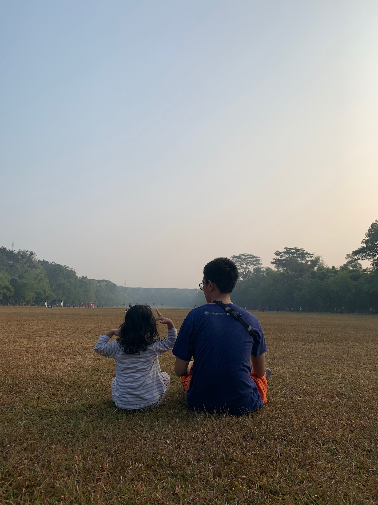

<section class="hero">

 Senior VP of Data · Consultant · Educator

<h1>I turn messy data into <em>useful decisions.</em></h1>

I’m Rendy Bambang Junior, a data and AI leader in Jakarta. I build teams, platforms, and intelligent products that turn technical capability into measurable business value.

<a href="blog/" class="button button--primary">Read my field notes</a>
<a href="#about" class="button button--quiet">More about me</a>

CAREER SIGNAL2014—NOW

<strong>10+ years</strong>engineering → leadership

Data gives me the pattern. Photography gives me the pause.

</section>

<section class="home-section home-about" id="about">

01 / ABOUT

<h2>I build with data. I lead with <em>clarity.</em></h2>

For more than a decade, I’ve worked across software engineering, data platforms, analytics, and AI—from building Traveloka’s data platform through 10,000× growth to leading company-wide AI adoption at Evermos. Alongside my executive role, I’m building <a href="https://insinyurdata.id/">Insinyur Data</a>, a consultancy that helps organizations make data and AI genuinely useful.

Outside the org chart: a learner, a father, a runner, and someone who brings a camera along.

</section>

<section class="home-section intro-grid">

02 / WHAT I DO
<h2>Building the systems behind better questions.</h2>

01<h3>Lead</h3>
Data organizations that connect technical excellence with real business outcomes.

02<h3>Build</h3>
Reliable platforms, analytics systems, and practical AI for teams at scale.

03<h3>Advise</h3>
Practical data and AI consulting through Insinyur Data, grounded in a decade of operating experience.

</section>

<section class="home-section values-preview">

03 / PRINCIPLES I RETURN TO

01<h3>Start with impact</h3>
I work backward from the outcome: a better decision, lower cost, faster operation, or stronger customer experience. Technology is the means, never the scorecard.

02<h3>Build for leverage</h3>
The best systems multiply a team’s ability. I look for platforms, automation, and operating models that make good work easier to repeat at scale.

03<h3>Grow capability</h3>
A mature data organization does more than answer requests. It teaches the wider business to ask better questions, experiment, and act with confidence.

04<h3>Earn trust by design</h3>
Quality, reliability, security, governance, and responsible AI belong in the architecture from the beginning—not in a cleanup phase.

05<h3>Experiment with discipline</h3>
I pair curiosity with measurement: test ideas, define evidence, learn quickly, and scale only what proves useful.

06<h3>Practice the craft</h3>
I care about the details beneath durable outcomes. Craftsmanship, resilience, and a growth mindset are how ambitious systems survive contact with reality.

</section>

<section class="home-section career-section">

04 / THE PATH SO FAR

<h2>Evidence, not adjectives.</h2>

<strong>1.88×</strong>quarter-on-quarter productivity improvement from company-wide AI adoption

<strong>7×</strong>year-on-year growth in measurable business impact from analytics

<strong>50%</strong>data infrastructure cost reduction while improving freshness and reliability

<strong>10,000×</strong>data growth supported while building Traveloka’s platform from scratch

<article class="career-entry career-entry--current">
<header><time>2025—NOW</time>
EVERMOS<h3>Senior VP of Data</h3>
</header>

Leading company-wide AI adoption, delivering a <strong>1.88× quarter-on-quarter productivity improvement.</strong>

Building customer-facing AI products and exploring RAG, organizational memory, LLM evaluation, and agentic workflows.

Raising data fluency through classes, coaching, and a company-wide maturity index.

</article>
<article class="career-entry">
<header><time>2023—2025</time>
EVERMOS<h3>VP of Data</h3>
</header>

Turned a reactive support function into a proactive team producing <strong>around 60 insights per quarter.</strong>

Created an analytics framework that grew measurable business impact <strong>7× year on year</strong> and raised stakeholder NPS from 46 to 81.

Cut infrastructure cost by 50%, grew experimentation past 100 tests a year, and established enterprise security and governance.

</article>
<article class="career-entry">
<header><time>2022—2023</time>
RUANGGURU<h3>Head of Data</h3>
</header>

Delivered recommendation, lead-scoring, and AI learning products—including Roboguru, which reached <strong>around 300,000 online sessions.</strong>

Reduced infrastructure cost by 40% and tackled data quality at its source through schema review and a redesigned tracking SDK.

</article>
<article class="career-entry">
<header><time>2019—2022</time>
RUANGGURU<h3>Senior Data Manager</h3>
</header>

Built the data warehouse from scratch and introduced modelstorming, reducing data-team effort by <strong>70%.</strong>

Automated lead decisions and assignment, making campaign operations <strong>20× more efficient</strong> while enabling more than 20 experiments each month.

</article>
<article class="career-entry">
<header><time>2014—2019</time>
TRAVELOKA<h3>Data Engineering Lead & Architect</h3>
</header>

Built batch and streaming platforms from scratch and supported <strong>10,000× data growth</strong> over three years.

Created real-time infrastructure capable of two million writes per second and resilient customer-data services for intelligent products.

Migrated Hadoop pipelines to serverless GCP architecture and built a warehouse serving around 25 business units.

</article>
<article class="career-entry">
<header><time>2013</time>
ACCENTURE<h3>Project Management Office</h3>
</header>

Supported a multi-year warehouse program for a major Indonesian telecommunications operator.

Managed risks across hundreds of upstream data sources with a focus on architecture, quality, and reliability.

</article>

GRADUATE EDUCATION<h3>Georgia Tech</h3>
MSc in Computer Science, Machine Learning specialization · GPA 3.90/4.00 · 2024

UNDERGRADUATE EDUCATION<h3>Bandung Institute of Technology</h3>
BE in Informatics, cum laude · GPA 3.90/4.00 · 2013

</section>

<section class="home-section recognition-section">

05 / COMMUNITY, SPEAKING & RECOGNITION

<h2>Sharing the work. <em>Earning the craft.</em></h2>

I learn in public—through mentoring, teaching, and conversations with the people building what comes next.

MENTORING & CONFERENCES05 ENTRIES

<article class="recognition-entry recognition-entry--active"><time>2022—NOW</time>
MENTORSHIP<h3>Mentor, Google for Startups Accelerator</h3>
Indonesia and Southeast Asia

</article>
<article class="recognition-entry recognition-entry--active"><time>2019—NOW</time>
COMMUNITY<h3>Google Developer Expert</h3>
AI and Cloud

</article>
<article class="recognition-entry"><time>2025</time>
B500 SUMMIT · JAKARTA<h3>Building Production-Ready AI Agents</h3>
</article>
<article class="recognition-entry"><time>2024</time>
CDAO<h3>Charting the Path to Ethical and Effective Data and AI Governance</h3>
</article>
<article class="recognition-entry"><time>2017</time>
GOOGLE CLOUD DEVELOPER · SINGAPORE<h3>Traveloka Keynote</h3>
</article>

AWARDS & CERTIFICATIONS05 ENTRIES

<article class="recognition-entry recognition-entry--featured"><time>2026</time>
CERTIFICATION<h3>Google Cloud Generative AI Leader</h3>
</article>
<article class="recognition-entry"><time>2016</time>
CERTIFICATION<h3>AWS Certified SysOps Administrator – Associate</h3>
</article>
<article class="recognition-entry"><time>2012</time>
ACADEMIC AWARD<h3>2nd Place Best Student, Informatics Engineering</h3>
Bandung Institute of Technology

</article>
<article class="recognition-entry"><time>2008</time>
NATIONAL SCIENCE OLYMPIAD<h3>Bronze Medal, Programming Competition</h3>
</article>
<article class="recognition-entry"><time>2008</time>
IPB<h3>3rd Place, National Programming Competition</h3>
</article>

</section>

<section class="home-section split-story">

SANUR BEAUTY · 2025 Look closely. The signal is often quiet.

06 / AWAY FROM THE SCREEN

<h2>Photography is how I practice attention.</h2>

Data asks me to find patterns across millions of rows. Photography asks me to be present for one frame. Both reward patience, curiosity, and a willingness to look again.

<a class="text-link" href="https://randcaptures.com/">See what catches my eye ↗</a>

</section>

<section class="home-section current-work">

07 / CONSULTING & TEACHING

<a href="https://insinyurdata.id/" class="current-card">CONSULTING<h3>Insinyur Data</h3>
Helping organizations turn data and AI ambition into useful systems, capable teams, and measurable outcomes.
<b>Work with us ↗</b></a>

TEACHING<h3>Industry Lecturer at ITB</h3>
I teach the Big Data course at Bandung Institute of Technology, bringing current industry practice into the classroom.
<b>Bandung · Indonesia</b>

<a href="https://shuttermor.com/" class="current-card current-card--product">PRODUCT<h3>ShutterMor</h3>
Learn photography by getting thoughtful, AI-powered feedback on every image you make.
<b>Improve your next shot ↗</b></a>

</section>

<section class="contact-strip">
HAVE A HARD DATA PROBLEM?
<h3>Let’s think it through together.</h3>
<a href="mailto:insinyur.data@gmail.com" class="button button--primary">Start a conversation</a>
</section>
