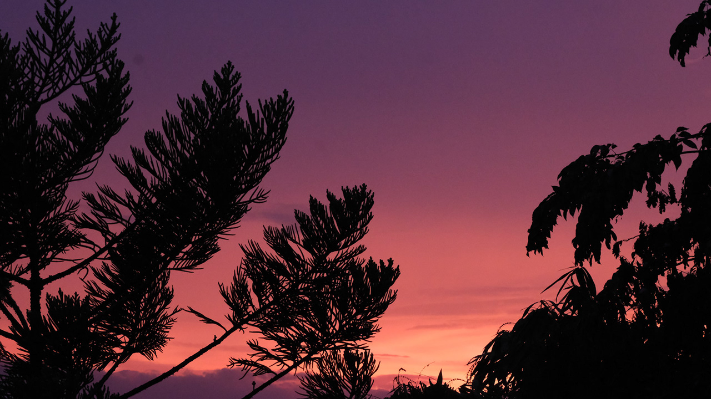
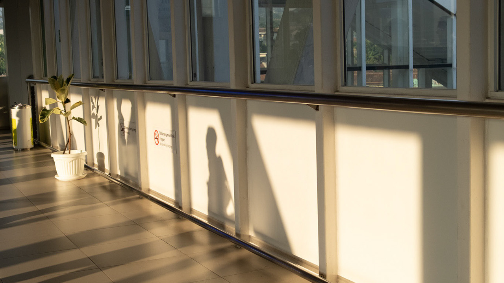

PHOTOGRAPHY / A PRACTICE IN ATTENTION

# Small moments, <em>held still.</em>

I spend much of my working life compressing reality into models, metrics, and decisions. Photography moves in the other direction: it asks me to slow down, notice the light, and let a single moment remain complicated.

  <figure class="photo-essay__hero"><figcaption>01
<strong>Sanur Beauty</strong> Still water, moving light.
</figcaption></figure>
  <figure><figcaption>02
<strong>Suburb Dusk</strong> A familiar skyline, briefly transformed.
</figcaption></figure>
  <figure><figcaption>03
<strong>Whoosh Padalarang</strong> Ordinary journeys have their own geometry.
</figcaption></figure>

## The camera and the dataset

Both begin with observation. Both are shaped by what is included, what is left out, and where the person behind the instrument chooses to stand. Photography keeps me honest about perspective—and reminds me that not everything meaningful can be measured.

[Explore the full photo journal ↗](https://randcaptures.com/){ .text-link }

